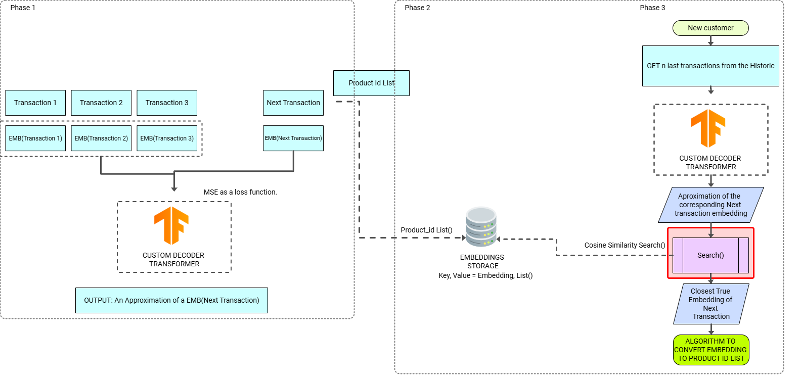
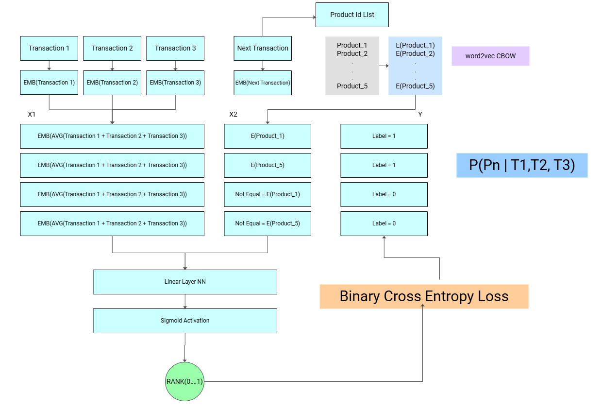

# Product Repurchase Prediction

## Team Members
- Fatemeh Gol Pour
- Anna Karolin
- Victor Peñaloza

## Project Overview
This repository contains our solution for the Kaggle AI Challenge focused on product repurchase prediction for supermarkets. The main objective was to develop an improved recommendation system that could predict the next 10 items a customer would most likely purchase in their next transaction.

## Problem Statement
The challenge required building a recommendation system that could:
- Process historical transaction data from 100,000 customers (2022-2023)
- Analyze customer purchasing patterns
- Consider product attributes and customer behavior
- Predict the top 10 products each customer would likely buy next

## Our Approaches

### 1. GPT Model Approach
We experimented with using GPT-2 as a recommendation engine using two main strategies:
- Individual transaction fine-tuning
- Sequence-based fine-tuning

**Key Features:**
- Feature importance analysis using mutual information
- Integration of product attributes
- Sequence modeling of customer transactions

### 2. Transformer Model with BERT Embeddings
This approach focused on using BERT to process product descriptions:
- Preprocessing of product descriptions
- Generation of transaction embeddings
- Similarity-based prediction

**Key Components:**
- Text preprocessing pipeline
- BERT embedding generation
- Similarity calculation system

### 3. Transformer Model with Word2Vec Embeddings
- Product identifier embeddings
- Sequential prediction
- Vector database integration
- Ranking model for final predictions

**Key Features:**
- Custom Word2Vec training for product embeddings
- Transformer-based sequential predictor
- Qdrant vector database integration
- Neural network-based ranking system

## Architecture




